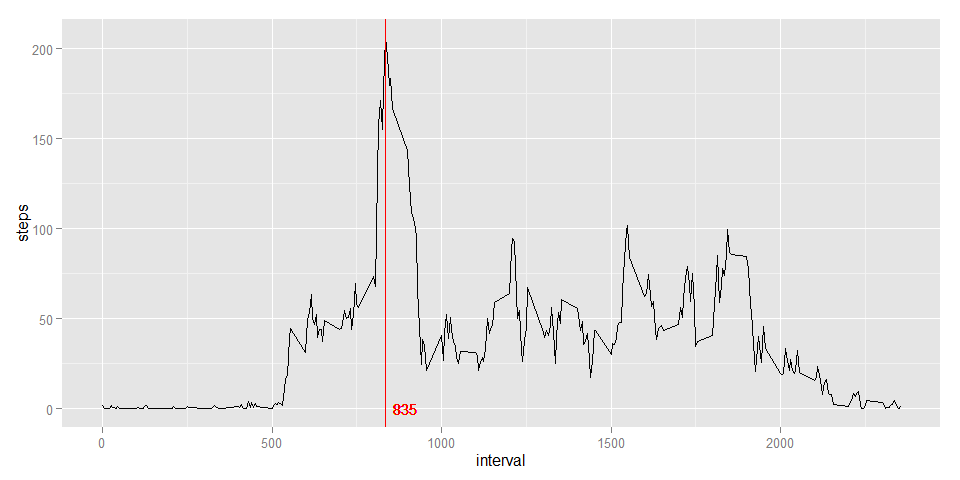
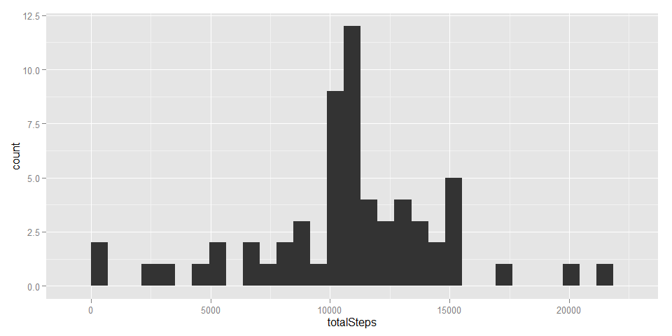
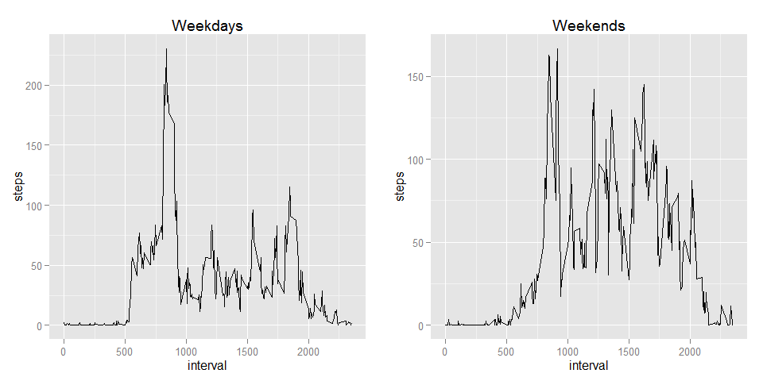

# Reproducible Research: Peer Assessment 1
Chiu Wei Chieh  

### Initialize and setup global options


```r
library(knitr)
library(ggplot2)
library(gridExtra)
library(xtable)
library(plyr)
opts_chunk$set(cache = TRUE, warning = FALSE, message = FALSE, fig.width = 10)
```

### Loading and preprocessing the data

In this section, we load data set and store it. The preprocessing will be performed in the following sections when needed.


```r
raw <- read.csv("./activity.csv")
```

### Task 1. What is mean total number of steps taken per day?

Use aggregate() to transform the raw dataset into a new dataset stepsPerDay.

stepsPerDay$date : the date when the data is collected  
stepsPerDay$totalSteps : total steps collected at that day.


```r
stepsPerDay <- aggregate(raw$steps, list(date = raw$date), sum)
names(stepsPerDay) <- c("date", "totalSteps")
```

Histogram of total number of steps per day.


```r
qplot(totalSteps, data=stepsPerDay, geom="histogram")
```

 

Mean and the median total number of steps per day. 


```r
meanTotal <- mean(stepsPerDay$totalSteps, na.rm = TRUE)
medianTotal <- median(stepsPerDay$totalSteps, na.rm = TRUE)
data.frame(mean = meanTotal, median = medianTotal)
```

```
##       mean median
## 1 10766.19  10765
```

### Task 2. What is the average daily activity pattern?

Use aggregate() to transform the raw dataset into a new dataset meanStepsPerInterval.

meanStepsPerInterval$interval : the 5-minute intervals of a day   
meanStepsPerInterval$steps : average steps of the 5-minute intervals across all days


```r
meanStepsPerInterval <- aggregate(steps ~ interval, data = raw, mean)
```

Find the interval that contains the maximum average steps and mark that interval on the plot. 


```r
maxStepsInterval <- meanStepsPerInterval$interval[which.max(meanStepsPerInterval$steps)]
maxStepsInterval
```

```
## [1] 835
```

```r
g <- ggplot(aes(x = interval, y = steps), data = meanStepsPerInterval)
g + geom_line() + geom_vline(xintercept = maxStepsInterval, colour = "red") + geom_text(data = NULL, x = 895, y = 0, size = 4, colour = "red", label = maxStepsInterval)
```

 

### Task 3. Imputing missing values

Use is.na() to test the raw dataset and store the result in variable naCount.


```r
naCount <- is.na(raw)
summary(naCount)
```

```
##    steps            date          interval      
##  Mode :logical   Mode :logical   Mode :logical  
##  FALSE:15264     FALSE:17568     FALSE:17568    
##  TRUE :2304      NA's :0         NA's :0        
##  NA's :0
```

The result shows that there is no NA in date and interval columns, but there are 2304 NAs in steps column. Now we need a strategy to deal with these NA values. First, let's see how these NA values distribute in the dataset. First we subset all rows contain NA. Then we count the NA values by interval and by date and store them in variables.


```r
naRaw <- raw[is.na(raw$steps),]

naCountByInterval <- count(naRaw, vars="interval")
summary(naCountByInterval)
```

```
##     interval           freq  
##  Min.   :   0.0   Min.   :8  
##  1st Qu.: 588.8   1st Qu.:8  
##  Median :1177.5   Median :8  
##  Mean   :1177.5   Mean   :8  
##  3rd Qu.:1766.2   3rd Qu.:8  
##  Max.   :2355.0   Max.   :8
```

```r
naCountByDate <- count(naRaw, vars="date")
naCountByDate
```

```
##         date freq
## 1 2012-10-01  288
## 2 2012-10-08  288
## 3 2012-11-01  288
## 4 2012-11-04  288
## 5 2012-11-09  288
## 6 2012-11-10  288
## 7 2012-11-14  288
## 8 2012-11-30  288
```

The summaries show that the data is completely missing in 8 different days. Either the participants forgot to collect data or the sensors simply malfunctioned. We are going to fill these blank days with the average steps of 5-minute interval across all days.

We combine meanStepsPerInterval and naCountByDate to create a new dataframe called naFilled in which the steps are the mean steps of each interval across all days. Then remove the na rows of raw dataset, and combine it with naFilled to create our imputed dataset. Finally, sort the new dataset by date and run is.na() again to make sure every NA is replaced.


```r
naFilled <- data.frame(steps = rep(round(meanStepsPerInterval$steps), 8), date = rep(naCountByDate$date, each = 288), interval = rep(meanStepsPerInterval$interval, 8))

notNaRaw <- raw[!is.na(raw$steps),]
newDataset <- rbind(notNaRaw, naFilled)
newDataset <- newDataset[order(newDataset$date),]

naNew <- newDataset[is.na(newDataset$steps),]
nrow(naNew)
```

```
## [1] 0
```

Now, use the same method of task 1. to plot the histogram of total steps per day.


```r
stepsPerDayNew <- aggregate(newDataset$steps, list(date = newDataset$date), sum)
names(stepsPerDayNew) <- c("date", "totalSteps")
qplot(totalSteps, data=stepsPerDayNew, geom="histogram")
```

 

```r
meanTotalNew <- mean(stepsPerDayNew$totalSteps)
medianTotalNew <- median(stepsPerDayNew$totalSteps)
data.frame(dataset = c("raw", "imputed"), mean = c(meanTotal, meanTotalNew), median = c(medianTotal,medianTotalNew))
```

```
##   dataset     mean median
## 1     raw 10766.19  10765
## 2 imputed 10765.64  10762
```

We can see the counts increase in the histogram, due to filled NA rows. And the mean and median steps have only little difference between raw and imputed dataset. There could be several reasons :   

* First, when we calculate the mean at task 1., we set na.rm = TRUE, otherwise we will get NA as results, which means we already omitted the effect of NAs.
* Second, we filled the NA values with mean steps of interval, so the distribution of the new dataset should be similiar to original dataset.  

### Task 4. Are there differences in activity patterns between weekdays and weekends?

To compare the activity patterns, first we create a new column for the imputed dataset and fill in the transformed date. And then we seperate weekdays and weekends dataset. Use the same process in task 2. to calculate the mean steps of intervals across weekdays and weekends and plot them. 

From the figures, we can see that the participants are more active at the weekends.


```r
newDataset <- mutate(newDataset, 
                     days = weekdays(as.Date(newDataset$date), abbreviate = TRUE),
                     weekends = FALSE
                     )
for(i in 1:dim(newDataset)[1]){
  if((newDataset$days[i] == "週六") || (newDataset$days[i] == "週日")){
    newDataset$weekends[i] <- TRUE
  }
}

weekdaysData <- newDataset[(!newDataset$weekends),]
weekendsData <- newDataset[(newDataset$weekends),]

meanStepsWeekdays <- aggregate(steps ~ interval, data = weekdaysData, mean)
meanStepsWeekends <- aggregate(steps ~ interval, data = weekendsData, mean)

plot1 <- qplot(interval, steps, data=meanStepsWeekdays, geom="line", main = "Weekdays")
plot2 <- qplot(interval, steps, data=meanStepsWeekends, geom="line", main = "Weekends")
grid.arrange(plot1, plot2, ncol=2)
```

 


