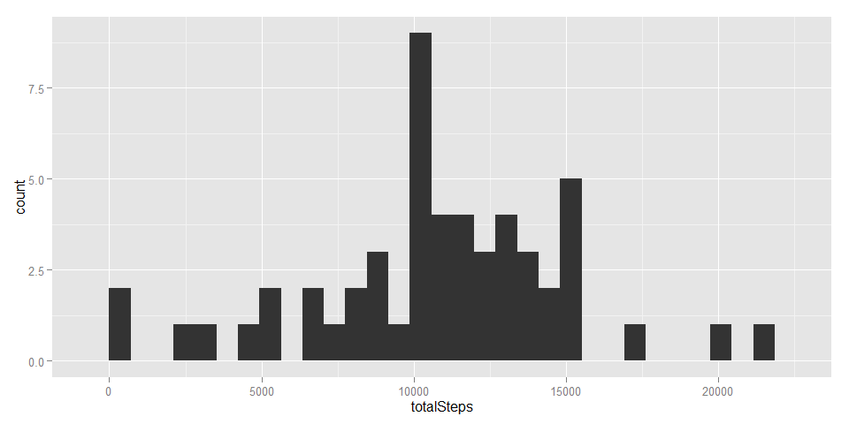

# Reproducible Research: Peer Assessment 1
Chiu Wei Chieh  

### Initialization and global options


```r
library(knitr)
library(ggplot2)
library(xtable)
opts_chunk$set(cache = TRUE, warning = FALSE, message = FALSE)
```

### Loading and preprocessing the data

Load raw dataset :  


```r
raw <- read.csv("./activity.csv")
plot(raw$date, raw$steps)
```

 

Calculate total steps per day :  


```r
stepsPerDay <- aggregate(raw$steps, list(date = raw$date), sum)
names(stepsPerDay) <- c("date", "totalSteps")
```

## What is mean total number of steps taken per day?

Histogram of total number of steps per day :  


```r
qplot(totalSteps, data=stepsPerDay, geom="histogram")
```

 

## What is the average daily activity pattern?


## Imputing missing values


## Are there differences in activity patterns between weekdays and weekends?
